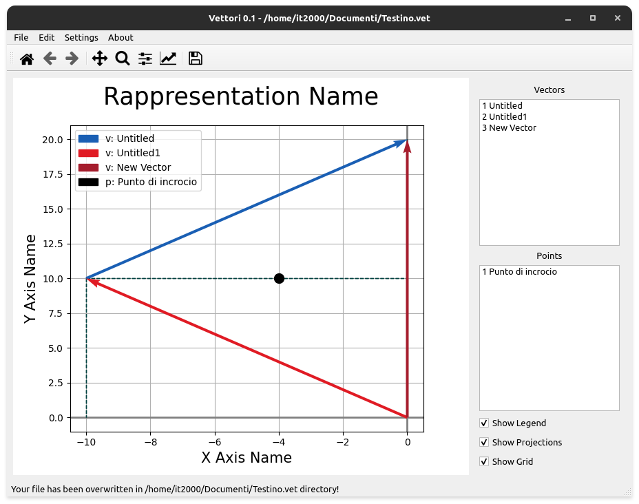

# Vettori
Physical representation of vector forces
Vectors is a graphical software for representation
Vectors is a graphical software for representation
of vector forces, has a graphic that acts as a
blackboard for the physical representation of vector forces,
meant to make graphical representations of problems of
physics and create images to make examples and lessons in physics.
Complementary written in python it uses the pyqt5 module
https://pypi.org/project/PyQt5/ for graphical interfaces and the
matplotlib library https://matplotlib.org/ for the graphic board
while the main window and the dialog window have been drawn
with the qt-designer (present in the "Ui Files" folder) and converted 
into python code with pyuic5 (present in source / Dialogs).
It is currently available for windows and linux (any distribution),
for windows the source code is generated in exe with the pyinstaller module, 
which creates an executable file in exe along with any dependencies required to 
make it work, while the setup was created with Inno Setup https://jrsoftware.org/isinfo.php .
For linux instead it works using a virtual environment,
created with python-venv, which allows you to have no problems
platform with regard to certain library versions
then the python code and the virtual environment are copied to the / usr / share folder while 
in / usr / bin a link is created to the bash script (present in the bin catella) which runs the 
program using the virtual environment as well as passing the right parameters,
Also included is the creation of a new mimetype.



# Installtion
If you are on windows, you can safely run the installation setup program, while 
instead you are on linux open the terminal and go to the repository folder, 
so at this point if you want to recreate the virtual environment, type: 
```
make clean 
make 
```
while to simply install the application, type:
```
sudo make install
```
and if you want to uninstall it:
```
sudo make uninstall
```
